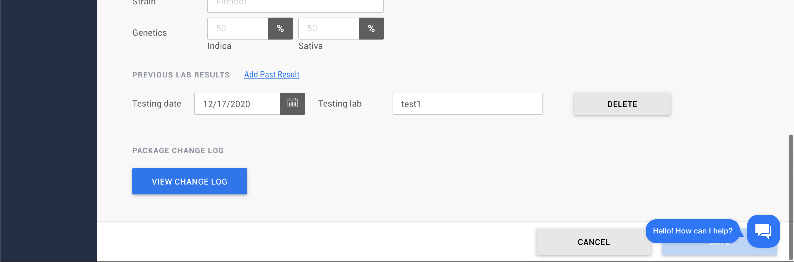

# HelpCrunch
https://docs.helpcrunch.com/developers
HelpCrunch is a customer communication platform

## Pros
- Really easy integration, I did it in less then 5 minutes

```
<script type="text/javascript">
(function(w,d){
  w.HelpCrunch=function(){w.HelpCrunch.q.push(arguments)};w.HelpCrunch.q=[];
  function r(){var s=document.createElement('script');s.async=1;s.type='text/javascript';s.src='https://widget.helpcrunch.com/';(d.body||d.head).appendChild(s);}
  if(w.attachEvent){w.attachEvent('onload',r)}else{w.addEventListener('load',r,false)}
})(window, document)
</script>
```

```
<script type="text/javascript">
  HelpCrunch('init', 'bloomup', {
    applicationId: 1,
    applicationSecret: 'secret-key'
  })

  HelpCrunch('showChatWidget');
</script>
```

- Flexible and rich widget customization. It is possible to add our custom CSS
https://docs.helpcrunch.com/setup/custom-css

- Good UI/UX experience

## Cons
- The widget takes a while to appear on the screen, but nothing so significant
- Limited third-party integrations
- The widget can overwrite some elements on the page as tables, would be nice to minimize it if necessary (You can hide the HelpCrunch chat widget from certain pages of your website if you want to.) - https://docs.helpcrunch.com/setup/show-hide-chat-widget



